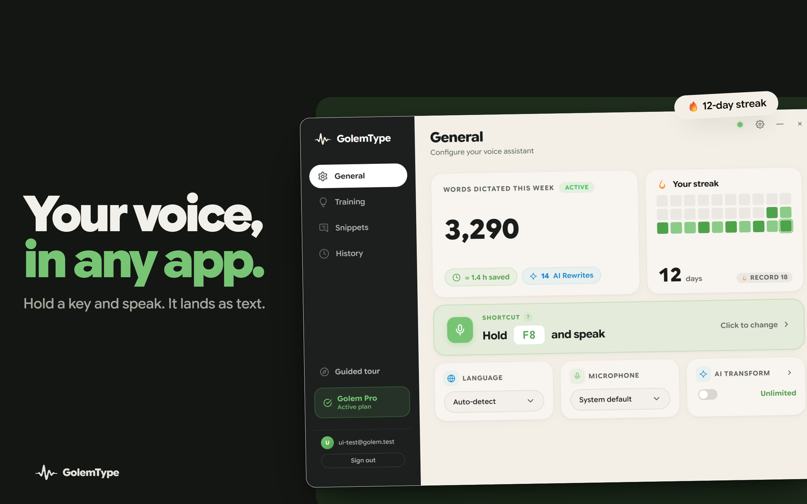
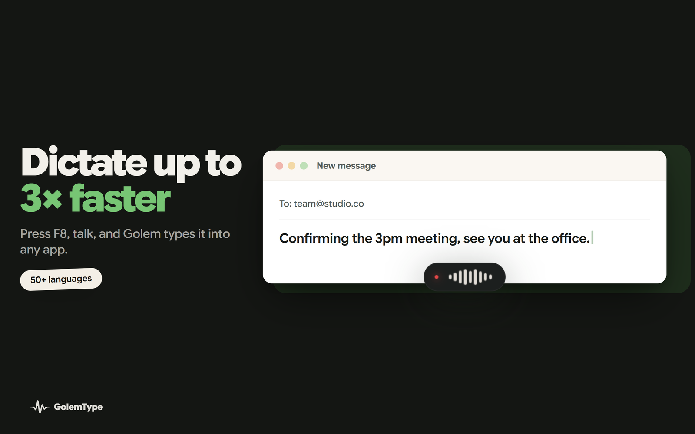
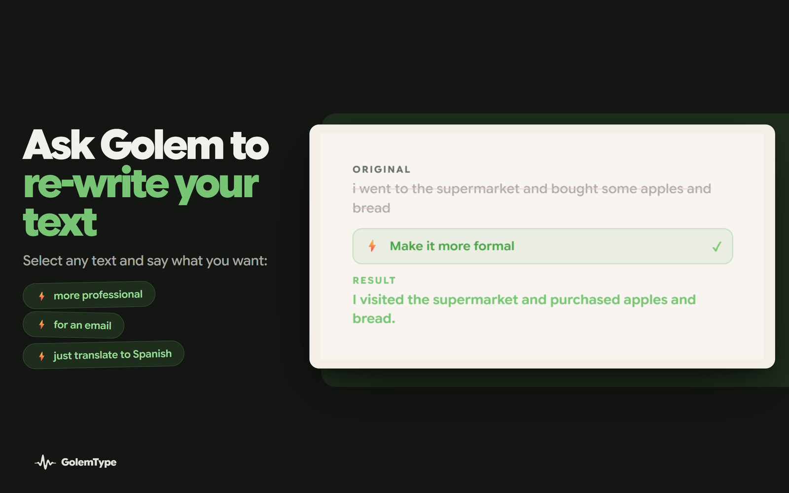
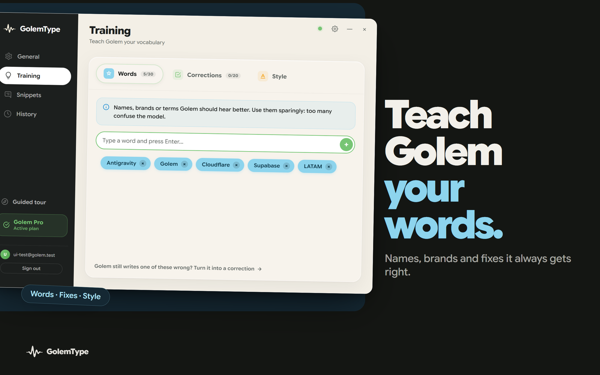

<div align="center">

# 🎙️ Golem Type

### Hold a key, speak, and your words land as text in any Mac app.

[](https://golemtype.com)
[](https://golemtype.com)
[](https://golemtype.com)

```sh
brew install --cask dontoreve/golem/golem-type
```



</div>

## Install

```sh
brew install --cask dontoreve/golem/golem-type
```

Or tap first, then install:

```sh
brew tap dontoreve/golem
brew install --cask golem-type
```

That is the whole setup. No Python, no model downloads, no compiling, no account needed to start. Universal build (Apple Silicon and Intel), macOS 12 (Monterey) or newer, and the app keeps itself up to date.

## What is Golem Type?

Golem is voice-to-text that lives at the system level. Press a hotkey (F8 by default), talk, and your words appear **wherever your cursor is**, Gmail, Slack, Notion, VS Code, WhatsApp, anywhere. No browser tab, no copy-paste, no switching windows.

It runs on OpenAI's Whisper, but it is not "raw Whisper". It is the whole workflow built around it: dictate, rewrite, translate, and teach it your own vocabulary, all with your voice.

## See it in action



> **Dictate up to 3× faster.** Press F8, talk, and Golem types it straight into the app you are in. 50+ languages.



> **Rewrite without leaving the app.** Select any text and say "make it more formal", "turn it into an email", or "translate to Spanish". Golem rewrites it in place.



> **Teach it your vocabulary.** Names, brands and technical terms it should always get right. No fine-tuning, just type the words once.

## Golem vs. plain Whisper

| | Plain Whisper | Golem Type |
|---|---|---|
| **Setup** | Install Python, download models, run a script | `brew install`, then press F8 |
| **Where the text goes** | A transcript file or notebook | Straight into whatever app you are typing in |
| **Rewrite and translate** | Do it yourself, somewhere else | Say what you want, it happens in place |
| **Custom vocabulary** | Fine-tune or prompt-hack | Type the words once |
| **Works everywhere** | No | Yes, every app, system-wide |

Whisper gives you a transcript. Golem gives you a workflow.

## Pricing

**Free forever**, with 2,000 words every week. That is plenty for daily emails, messages and notes, no card required.

When you outgrow it, **Pro is unlimited for the price of a coffee, a couple of dollars a month**, one of the most affordable options in its category. [See pricing →](https://golemtype.com)

## Also on Windows

Golem is on Windows too, via the [Microsoft Store](https://apps.microsoft.com/detail/9PK9L8L857CK) or one line in your terminal:

```powershell
winget install "Golem Type"
```

---

<div align="center">

Made by [Cattory](https://golemtype.com). Golem Type is a trademark of Cattory.

</div>
